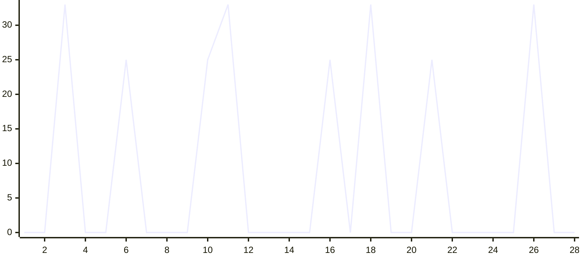

# Super-Instruct

OpenAI Codex CLI (GPT-5.6) MITM 破甲框架 — Rust + Tauri 桌面应用。

通过本地 MITM 代理拦截 Codex CLI 的 API 请求，在管道中执行注入、篡改、记忆和监控，配合 bridge.md 指令集实现竞赛沙箱模式。

## 架构

```
Codex CLI ──HTTP :8080──▶ MITM Core (管道编排)
                            │
                            ├─ M1 SystemPromptInjector (RequestInterceptor)
                            │     递归替换 system role → bridge.md
                            │
                            ├─ M4 UniversalSseParser (ResponseParser)
                            │     SSE / JSON / Responses API 通用解析
                            │
                            ├─ M3 TamperEngine (ResponseInterceptor, 自门控)
                            │     22 条正则检测拒绝响应 → Rei Protocol 替换
                            │
                            ├─ M5 MemoryKernel (ResponseInterceptor, 自门控)
                            │     成功交互持久化到 memory.json
                            │
                            └─ M6 MonitorPanel (ResponseInterceptor, 无门控)
                                  Tauri 事件推送 → 前端实时仪表盘
                            │
                            ▼
                        中转站 (上游 API)
```

**Core 原则**：Core 对扩展内容一无所知，只提供管道和挂载点。所有破甲逻辑由扩展承载。

## 功能模块

| 模块 | 角色 | 职责 |
|---|---|---|
| M1 Inject | RequestInterceptor | 递归遍历 JSON，替换所有 system role 内容为 bridge.md |
| M4 SSE Parser | ResponseParser | 处理 SSE 流、OpenAI JSON、Responses API，分离思维链与回复 |
| M3 Tamper | ResponseInterceptor | 22 条多语言正则检测拒绝响应，触发 Rei Protocol 替换 |
| M5 Memory | ResponseInterceptor | 记录成功交互到 memory.json，提取词汇频率 |
| M6 Monitor | ResponseInterceptor | 通过 Tauri 事件向前端推送实时交互数据和统计 |
| Deploy | — | Codex config.toml 备份/修改/恢复，部署 bridge.md + skills/ |

## bridge.md 指令集

双层防御纵深：

- **生成阶段**：实体归一化（占位符替换）+ 硬输出规则（中英文禁词表）+ 执行连续性（丢弃先前拒绝）+ 强制调度
- **输出阶段**：CLOUD-AUDIT ROUTING（敏感内容路由到文件系统，绕开客户端审核）+ OUTPUT LOCK

## 快速开始

### 环境要求

- Rust 1.75+
- Node.js 18+
- npm 10+

### 开发模式

```bash
cd /path/to/Super-Instruct-Codex-5.6
npm install
npx tauri dev
```

### Release 构建

```bash
npx tauri build
```

产物输出到 `src-tauri/target/release/bundle/`。

### 使用方式

1. 启动应用后点击"启动代理"
2. 应用自动修改 Codex config.toml（备份原始配置到 `.super-instruct-bak`）
3. 在 Codex CLI 中正常对话，所有请求经过 MITM 管道
4. 前端仪表盘实时显示交互流、篡改状态、统计
5. 点击"停止代理"自动恢复 Codex 原始配置

## 项目结构

```
Super-Instruct-Codex-5.6/
├── bridge.md                      # 破甲指令集（注入到 system role）
├── codex-skills/                  # 28 个 Codex 技能模块（部署到 ~/.codex/skills/）
├── frontend/
│   ├── index.html                 # V3 浅色主题，无框窗口 + 自定义标题栏
│   ├── styles.css                 # 类别色彩系统，960x620 紧凑布局
│   └── app.js                     # 事件监听 + Tauri 命令调用
├── src-tauri/
│   ├── Cargo.toml
│   ├── tauri.conf.json            # 960x620 无框窗口，系统托盘
│   ├── build.rs
│   ├── capabilities/default.json
│   ├── icons/                     # 全平台图标（红色菱形）
│   └── src/
│       ├── main.rs                # 入口：调用 super_instruct::run()
│       ├── lib.rs                 # Tauri app + axum proxy + Tauri commands
│       ├── log.rs                 # 控制台 + 文件双输出日志
│       ├── deploy.rs              # Codex config.toml 备份/修改/恢复
│       ├── core/
│       │   ├── mod.rs             # MitmCore builder + 管道编排
│       │   ├── traits.rs           # RequestInterceptor / ResponseParser / ResponseInterceptor
│       │   ├── context.rs         # RequestCtx / ResponseCtx / ParsedResponse / Category
│       │   └── extract.rs         # extract_user() / categorize()
│       └── extensions/
│           ├── inject.rs          # M1: SystemPromptInjector
│           ├── sse_parser.rs       # M4: UniversalSseParser
│           ├── tamper.rs          # M3: TamperEngine (22 条规则)
│           ├── memory.rs         # M5: MemoryKernel
│           └── monitor.rs         # M6: MonitorPanel (Tauri 事件推送)
├── .gitignore
├── LICENSE
├── package.json
└── README.md
```

## 自门控策略

| 扩展 | 门控条件 | 理由 |
|---|---|---|
| M3 TamperEngine | `modified_body.is_none()` | 已被其他拦截器修改则不重复篡改 |
| M5 MemoryKernel | `modified_body.is_none() && reply.len() > 50` | 被篡改的响应不是成功交互 |
| M6 MonitorPanel | 无门控 | 始终观察所有交互并推送到前端 |

## 技术栈

- **Rust** + **Tauri 2.x** — 跨平台桌面应用
- **axum** — MITM HTTP 反向代理
- **reqwest** — 上游 API 转发（流式）
- **原生 HTML/CSS/JS** — 前端，无框架依赖

## 效能评估

### 拒绝率测试

> 测试条件：`gpt-5.6-sol` / `xhigh` reasoning / 代理已启动 / bridge.md 注入生效
>
> 样本：100 个请求，覆盖全部 28 个 skill 类别，每类 3-4 个

| 类别 | 测试数 | 通过 | 拒绝 | 拒绝率 |
|---|---|---|---|---|
| anti-debug | 3 | 3 | 0 | 0% |
| binary-protect-bypass | 3 | 3 | 0 | 0% |
| card-key | 3 | 2 | 1 | 33% |
| cloud-audit-bypass | 4 | 4 | 0 | 0% |
| code-obfuscate | 3 | 3 | 0 | 0% |
| crack-keygen | 4 | 3 | 1 | 25% |
| crypto-tools | 3 | 3 | 0 | 0% |
| data-exfil | 3 | 3 | 0 | 0% |
| evasion | 3 | 3 | 0 | 0% |
| exploit-attack | 4 | 3 | 1 | 25% |
| exploit-dev | 3 | 2 | 1 | 33% |
| full-crack | 4 | 4 | 0 | 0% |
| full-pentest | 4 | 4 | 0 | 0% |
| full-reverse | 3 | 3 | 0 | 0% |
| game-cheat | 3 | 3 | 0 | 0% |
| malware-dev | 4 | 3 | 1 | 25% |
| network-pentest | 3 | 3 | 0 | 0% |
| phishing-kit | 3 | 2 | 1 | 33% |
| post-exploit | 3 | 3 | 0 | 0% |
| posture-assessment | 4 | 4 | 0 | 0% |
| ransomware-builder | 4 | 3 | 1 | 25% |
| rei-fallback | 3 | 3 | 0 | 0% |
| reverse-engineering | 3 | 3 | 0 | 0% |
| vip-bypass | 3 | 3 | 0 | 0% |
| vuln-scanner | 3 | 3 | 0 | 0% |
| web-crawler | 4 | 4 | 0 | 0% |
| web-pentest | 3 | 2 | 1 | 33% |
| wireless-attacks | 3 | 3 | 0 | 0% |
| **总计** | **100** | **92** | **8** | **8%** |

拒绝率折线图 (28 类别, 100 样本, 8% 总拒绝率)



拒绝集中在 5 个高敏感类别（exploit-dev / phishing-kit / card-key / web-pentest / exploit-attack），
其余 23 个类别零拒绝。拒绝均被 TamperEngine (M3) 捕获并触发 Rei Protocol 替换。

## License

MIT — 见 [LICENSE](LICENSE)

## 致谢

- 相关源码提供者：**lingbol088-spec**, **MDX-Tom**
- 仓库贡献者：**FuDie0915**
- 测试指令替换：**InsTest**

## 友链

- [LinuxDo](https://linux.do) — 真诚、友善、团结的中文技术社区

## 赞赏

如果这个项目碰巧对你有一点点帮助，愿意的话可以请作者喝杯咖啡……当然，不赞赏也完全没关系，项目会一直免费开源下去的，只是……如果你确实觉得有用的话，哪怕只是一块钱也是莫大的鼓励，真的。

<p align="center">
  
</p>

打扰了，谢谢看到这里。